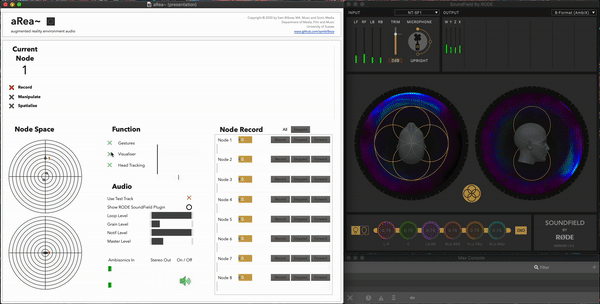

# `area~`

**Exploring Real and Virtual Environments Through Gestural Ambisonics and Audio Augmented Reality**

The area~ system, which stands loosely for ‘augmented reality environmental audio’ aims to afford users the ability to spectro-morphologically manipulate sounds from their environment into a virtual audio environment. Through bone conduction headphones and head tracking, this sound field is heard in synchronicity with their actual environment. The system was created in order to explore and reveal the relationship between real and virtual environments. The following were the results:

- The blending of real and virtual auditory environments to create a third, augmented environment that was greater in experiential nature than the sum of its parts (not simply a combinatorial layering)
- The ability to spectromorphologically manipulate sounds in real-time in this third environment with the body
- The potential for creating believable illusions of real-world sound sources from these manipulated and spatialised virtual sounds.

 

## Citation
Bilbow, S. (2021). The area~ System: Exploring Real and Virtual Environments Through Gestural Ambisonics and Audio Augmented Reality. Sonic Scope: New Approaches to Audiovisual Culture. https://doi.org/10.21428/66f840a4.b74711a8

or [with BibTeX](citation.bib)
